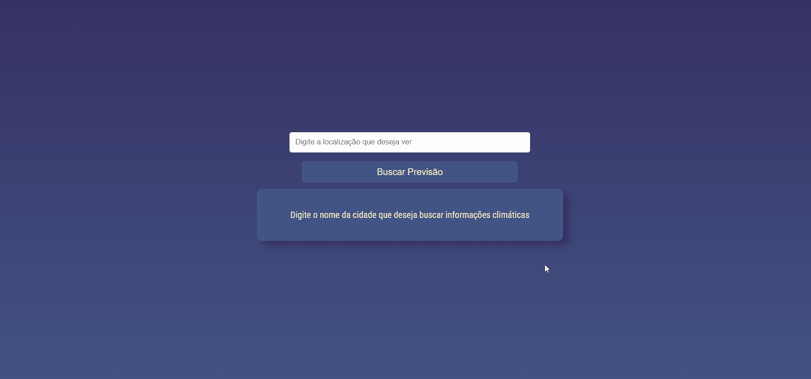

# 🌤️ Previsão do Tempo

Aplicação web para consulta de previsão do tempo em tempo real e para os próximos 5 dias, com design responsivo e integração à API OpenWeatherMap.

## ✨ Demonstração

 

## 🚀 Recursos

- 🔍 Busca por cidade
- 📱 Responsivo (mobile e desktop)
- ⏱️ Previsão atual e para 5 dias
- 🌡️ Temperatura, umidade, vento
- 🌈 Ícones dinâmicos do clima
- 💾 Armazena última pesquisa

## 🛠 Tecnologias

  
  
  
  

## 🌐 Acesse Online

**Site**: [https://previsao-do-tempo-bice.vercel.app](https://previsao-do-tempo-bice.vercel.app)

## 🎨 Design

### Paleta de Cores

  
#363062

  
#435585

  
#F5E8C7

### Tipografia
| Elemento       |                                                     Fonte               |                      |
|----------------|---------------------|----------------------------------|
| Textos         | `Roboto Condensed`  |  |
| Títulos        | `Fugaz One`         |  |
